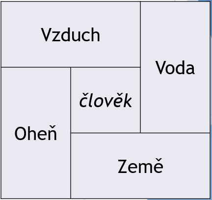

# Elementy

V souboru `index.html` vytvořte HTML tabulku dle návrhu (data musíte vepsat ručně):

* Střed je opravdu zvýrazněn – pomocí kurzívy

* Až budete mít hotovo, zkuste smazat člověka
* *Kód pro orámování buněk je už vložen do hlavičky*
* *Neřešte šířky a výšky buněk, ty za vás řeší automaticky prohlížeč, zatím je ovlivnit neumíme*